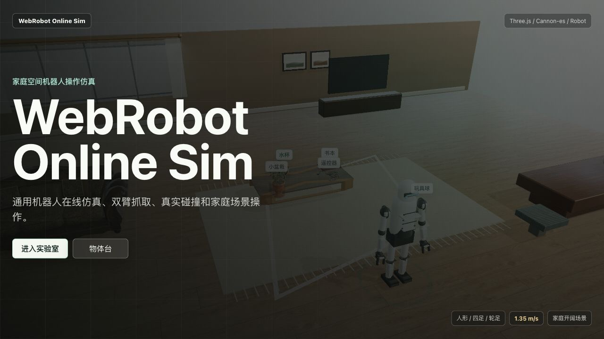
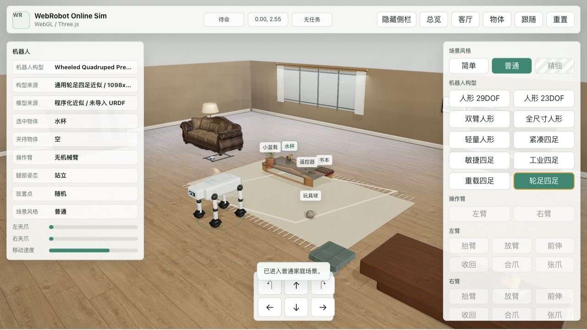
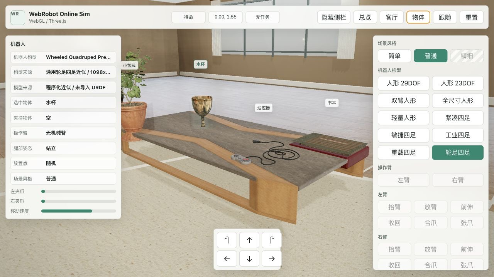
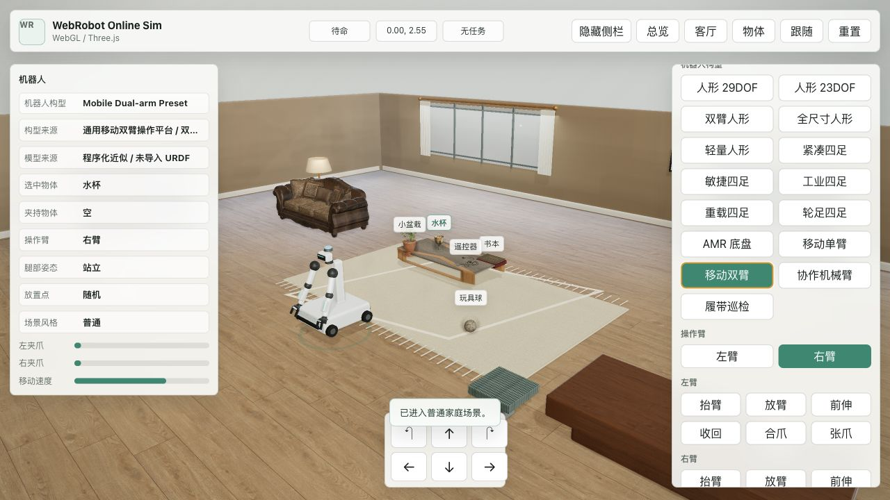
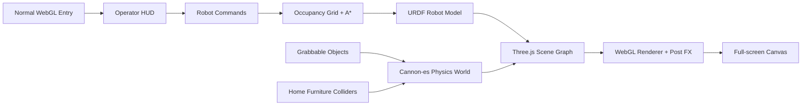

# WebRobot Online Sim

<p align="center">
  
</p>

<p align="center">
  <strong>Browser-native online robot simulation for humanoid, quadruped, and wheeled robot operation.</strong>
</p>

<p align="center">
  <a href="#quickstart"></a>
  <a href="#runtime"></a>
  <a href="#runtime"></a>
  <a href="#deploy"></a>
</p>

WebRobot Online Sim is a Three.js / WebGL sandbox built around an open home
environment, procedural generic robot platforms, dual-arm humanoid controls,
Cannon-es physics, and obstacle-aware navigation. It is designed as a visual
reference prototype for browser-side robot operation workflows across different
robot form factors.

## Demo

<video src="docs/videos/webrobot-rich-entry.mp4" controls muted loop playsinline poster="docs/readme/hero-rich-home.jpg" width="100%"></video>

[Open the demo video](docs/videos/webrobot-rich-entry.mp4) if your Markdown
viewer does not render embedded videos.

## Visual Tour

| Normal home entry | Robot operation lab |
| --- | --- |
|  |  |
| Live WebGL landing screen with normal-mode lighting, home layout, and entry actions. | Full operation UI with robot platform switching, dual-arm controls, drop targets, and navigation state. |

| Object workbench | Robot platform presets |
| --- | --- |
|  |  |
| Close object view for textured props, placement surfaces, and manipulation feedback. | Humanoid, quadruped, mobile manipulator, collaborative arm, AMR, and tracked presets share one browser control surface. |

## Highlights

- **Multiple robot platforms**: switchable humanoid, quadruped, wheeled quadruped, AMR base, mobile manipulator, mobile dual-arm, collaborative arm, and tracked inspection URDF profiles.
- **URDF model loading**: Unitree G1, R1, and Go2 load official URDF meshes; generic AMR, mobile-manipulator, cobot, and tracked profiles load local URDF files.
- **Explicit model boundary**: URDF visuals are the visible robot models, while the simplified internal rig remains only for browser-side collision, navigation, and gripper target calculation.
- **Dual-arm manipulation**: independent left/right arm lift, lower, reach, retract, gripper close, and gripper open controls.
- **Physical interaction**: Cannon-es bodies for floor, furniture, robot collision, and dynamic item settling after release.
- **Obstacle-aware tasks**: grab and place actions use an in-browser occupancy grid and A* path planner derived from the same furniture colliders.
- **Leg pose controls**: standing, half-squat, deep squat, and left/right leg lift poses are animated with the robot body.
- **Normal visual mode**: local PBR textures, HDRI environment lighting, SSAO, restrained bloom, contact shadows, and glTF household props.
- **Fine mode placeholder**: a locked fine-mode entry is visible in the HUD and opens a contact dialog for custom high-fidelity access.
- **Manual placement workflow**: select a drop target, then place the active arm's held item at that chosen household surface.
- **Responsive operator HUD**: sidebars can be hidden, and the same scene works from desktop and narrow browser viewports.

## Quickstart

```bash
npm install
npm run dev
```

Open the printed Vite URL. The default local URL is usually:

```text
http://127.0.0.1:5173/
```

For a production build:

```bash
npm run build
npm run preview
```

## Controls

| Area | Control | Behavior |
| --- | --- | --- |
| Entry | `进入实验室` / `物体台` | Start from the normal home screen and fly into the normal lab or object workspace. |
| Movement | Arrow keys / on-screen arrows | Move forward, backward, left, and right in the robot's local frame. |
| Rotation | `Q` / `E` or turn buttons | Rotate the robot while preserving physics collision. |
| Selection | Click an object | Select a grabbable household item. |
| Task | Grab / Place | Approach, grasp with the active arm, then place at the chosen or random target. |
| Robot platform | Humanoid / Quadruped / Mobile buttons | Switch between humanoid, quadruped, mobile manipulator, cobot, and tracked inspection procedural robot platforms. |
| Arm mode | Left / Right | Choose the active manipulation arm on humanoid platforms. |
| Arm motion | Lift, Lower, Reach, Retract | Adjust each arm pose independently. |
| Gripper | Close / Open | Operate the selected arm gripper. |
| Legs | Stand / Squat / Leg lift | Trigger whole-body pose changes for low manipulation and stepping tests. |
| Camera | Overview / Living room / Object / Follow | Switch between room, object-detail, and robot-follow views. |
| Fullscreen | Fullscreen button / `F` | Enter or leave fullscreen simulation mode. |

## Runtime



The app keeps the visual scene and physics scene aligned: furniture colliders are
used for physics and path planning, item bodies remain dynamic after release, and
robot movement is velocity-driven instead of teleporting through obstacles.

## Project Structure

```text
.
├── src/
│   ├── main.js        # Three.js scene, robot rig, physics, UI, planner
│   └── style.css      # HUD, normal entry screen, responsive layout
├── docs/
│   ├── readme/        # README-only normal-mode screenshots
│   ├── videos/        # README demo videos
│   └── images/        # Historical verification screenshots
├── public/            # Local HDRI, PBR, and glTF assets
├── references/        # External reference projects, intentionally untracked
└── vite.config.js     # Vite base config for GitHub Pages
```

## Visual Assets

Normal mode uses local assets and CC0 material/model sources:

- Poly Haven: `Laminate Floor 02`, `Fabric Pattern 07`, `Glasshouse Interior`, `Potted Plant 01`, `Book Pattern`, `Beige Wall 001`, `Wool Boucle`, `Sofa 03`, `Modern Coffee Table 01`, `Gamepad`, `Brass Goblets`, `Football`.
- ambientCG: `Carpet016` wool carpet PBR maps.
- Generated local maps: object roughness/bump maps, contact shadows, and UI-oriented scene captures.

## Reference Projects

- `references/three-cesium-examples`: scene registry and WebGL example organization.
- `references/aeroradar`: native Three.js scene assembly, HUD layering, raycast picking, and entity status patterns.
- `references/messenger-copy`: Vite-based local setup and full-screen interactive composition.

## Robot Platforms

Selectable robot platforms are loaded through `urdf-loader` into the Three.js
scene. The procedural rig remains only as an invisible control and collision
skeleton for browser-side physics, gripper positions, and navigation.

| Platform | Current source | Manipulation |
| --- | --- | --- |
| Humanoid 29DOF Preset | Unitree G1 official `g1_29dof.urdf` + STL meshes | Dual-arm controls enabled |
| Humanoid 23DOF Preset | Unitree G1 official `g1_23dof.urdf` + STL meshes | Dual-arm controls enabled |
| Dual-arm Humanoid Preset | Unitree G1 official `g1_29dof.urdf` + STL meshes | Dual-arm controls enabled |
| Full-size Humanoid Preset | Unitree G1 official URDF scaled for full-size layout | Dual-arm controls enabled |
| Lightweight Humanoid Preset | Unitree R1 official `R1.urdf` + STL meshes | Dual-arm controls enabled |
| Compact Quadruped Preset | Unitree Go2 official URDF scaled down | Locomotion only |
| Agile Quadruped Preset | Unitree Go2 official URDF + DAE meshes | Locomotion only |
| Industrial Quadruped Preset | Unitree Go2 official URDF scaled for inspection profile | Locomotion only |
| Heavy Quadruped Preset | Unitree Go2 official URDF scaled for heavy profile | Locomotion only |
| Wheeled Quadruped Preset | Unitree Go2 official URDF with wheel-leg interaction mapping | Wheel-leg locomotion only |
| Autonomous Mobile Base Preset | Local generic AMR `mobile_base.urdf` | Navigation only |
| Mobile Manipulator Preset | Local generic `mobile_manipulator.urdf` | Single-arm controls enabled |
| Mobile Dual-arm Preset | Local generic `mobile_dual_arm.urdf` | Dual-arm controls enabled |
| Collaborative Arm Preset | Local generic `cobot_arm.urdf` | Single-arm controls enabled |
| Tracked Inspection Preset | Local generic `tracked_inspection.urdf` | Navigation only |

When a quadruped platform is selected, arm and gripper controls are disabled in
the UI so the capability boundary is clear.

## Robot References

The current browser scene imports URDF directly. Official Unitree description
packages are vendored selectively under `public/robots/urdf/unitree/`; locally
authored generic URDFs cover AMR, mobile-manipulator, cobot, and tracked
inspection platforms. The vendored Unitree license is kept at
`public/robots/urdf/unitree/LICENSE.unitree_ros`.

- [ROS 2 URDF documentation](https://docs.ros.org/en/humble/Tutorials/Intermediate/URDF/URDF-Main.html)
- [SDFormat specification](https://sdformat.org/spec/)
- [MuJoCo XML reference](https://mujoco.readthedocs.io/en/stable/XMLreference.html)
- [Open X-Embodiment project](https://robotics-transformer-x.github.io/)
- [NVIDIA Isaac Sim robot assets](https://docs.isaacsim.omniverse.nvidia.com/5.0.0/assets/usd_assets_robots.html)
- [Nav2 documentation](https://docs.nav2.org/)
- [Unitree G1 description in `unitree_ros`](https://github.com/unitreerobotics/unitree_ros/tree/master/robots/g1_description)
- [Unitree Mujoco](https://github.com/unitreerobotics/unitree_mujoco)
- [Unitree Go2 developer documentation](https://support.unitree.com/home/en/developer)
- [Unitree B2-W developer documentation](https://support.unitree.com/home/en/B2W_developer)
- [Unitree R1 product page](https://www.unitree.com/mobile/R1/)
- [Unitree official open-source page](https://www.unitree.com/cn/opensource/)

Full-body IK, higher-fidelity per-platform meshes for every non-Unitree generic
profile, and robot-grade SLAM remain future integration points.

## Navigation References

- [AlvaAR](https://github.com/alanross/AlvaAR): browser-side WebAssembly visual SLAM reference.
- [three-pathfinding](https://github.com/donmccurdy/three-pathfinding): Three.js navigation mesh reference.
- [MDN WebAssembly](https://developer.mozilla.org/en-US/docs/WebAssembly): browser runtime reference for future planning or SLAM modules.

## Deploy

The project is prepared for tag-driven GitHub Pages deployment. The expected
project-site URL for the current repository is:

```text
https://eust-w.github.io/webrobot/
```

```bash
npm run build
```

Automatic deployment runs from GitHub Actions when a tag is pushed:

```bash
git tag v0.1.0
git push origin v0.1.0
```

In the repository settings, GitHub Pages should use `GitHub Actions` as the
build and deployment source. See
[`docs/deployment-github-pages.md`](docs/deployment-github-pages.md) for the
setup checklist.

## Scope

This is a browser simulation prototype for interaction design and WebGL robotics
experimentation. It demonstrates scene-scale manipulation, physics proxies,
visual planning feedback, and operator controls, but it is not a hardware-ready
controller or safety-certified robotics stack.
